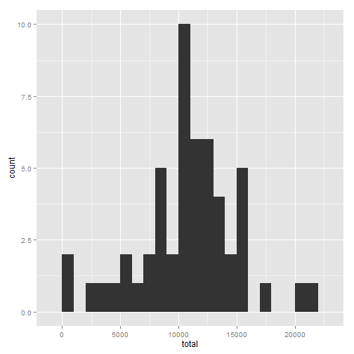
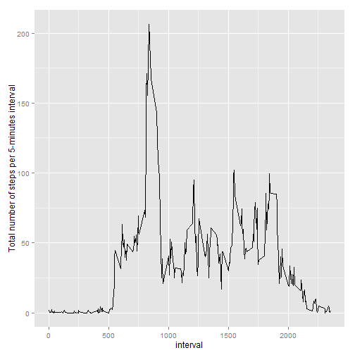
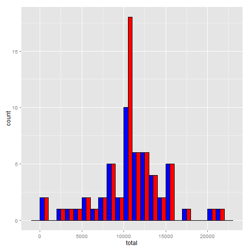
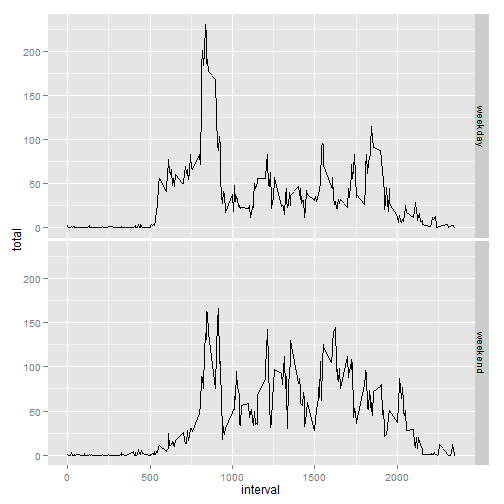

# Reproducible Research: Peer Assessment 1

## Introduction
This document has been elaborated as an assignment for the Reproducible Research course on www.coursera.org. It details a brief analysis of personal movement data acquired over a period of two months in 2012.
This report has been written by RaphT.

*Disclaimer: this is written in a somewhat didactic and sometimes unscientific way. I do not normally write reports this way ;-).*

## Data presentation
The data is contained in a zipped csv file. It contains three variables:

1. **interval**: the interval at which measurements are taken
2. **date**: the date at which the measurements are taken
3. **steps**: the number of steps the subject has taken in a specific interval

The file should contain a total of 17,568 observations.

## Loading and preprocessing the data
Let's start by loading some libraries that will prove useful:

```r
library(ggplot2);library(plyr)
```
I like setting up the programming environment by cleaning up my workspace before starting and setting the working directory (on the desktop... speak of hd space management...).

```r
rm(list = ls(all = TRUE))
setwd("C:\\Users\\rtornay\\Desktop\\DataScienceSpecialization\\RepData_PeerAssessment1")
```
The data can then be loaded. Let's do a basic check of the data (names of the columns, number of observations):

```r
df <- read.csv(unz(".//activity.zip", "activity.csv"), header=T)
head(df)
```

```
##   steps       date interval
## 1    NA 2012-10-01        0
## 2    NA 2012-10-01        5
## 3    NA 2012-10-01       10
## 4    NA 2012-10-01       15
## 5    NA 2012-10-01       20
## 6    NA 2012-10-01       25
```

```r
nrow(df)
```

```
## [1] 17568
```
As a final step in this first part, we can transform the date column class from factor to date:

```r
class(df$date)
```

```
## [1] "factor"
```

```r
df = transform(df, date = as.Date(date))
class(df$date)
```

```
## [1] "Date"
```
## What is mean total number of steps taken per day?
In this part of the assignment we can safely ignore the missing values so let's create a subset of df without its missing values.

```r
df2 = df[complete.cases(df),]
```
We can calculate the total number of steps per day. We can do this is one line with the *ddply* function from the *plyr* package. We can print the first few lines to convince ourselves that the data as been summarised by date:

```r
summaryDf2 =ddply(df2, .(date), summarise, total = sum(steps))
head(summaryDf2)
```

```
##         date total
## 1 2012-10-02   126
## 2 2012-10-03 11352
## 3 2012-10-04 12116
## 4 2012-10-05 13294
## 5 2012-10-06 15420
## 6 2012-10-07 11015
```
This summary data can then easily be plotted:

```r
ggplot(summaryDf2, aes(x = total))+geom_histogram(binwidth = 1000)
```

 

We can now calculate the mean and median of the total of steps per day:

```r
m = mean(summaryDf2$total); med = median(summaryDf2$total)
```
And print them:

```r
paste("Original(na ignored) mean is",round(m,2), "and median is", med)
```

```
## [1] "Original(na ignored) mean is 10766.19 and median is 10765"
```
Median and mean are very close.

## What is the average daily activity pattern?
We'll use *ddply* again to re-summarise our data, this time summarising by interval (and taking the mean). Plotting is done with ggplot.

```r
#Summarise data
summaryDf2 =ddply(df2, .(interval), summarise, total = mean(steps))
#Plot it
ggplot(summaryDf2, aes(x = interval, y = total))+geom_line()+
  scale_y_continuous(name = "Total number of steps per 5-minutes interval")
```

 

```r
#Find maximum
summaryDf2$interval[which.max(summaryDf2$total)]/60
```

```
## [1] 13.92
```
The last line of code indicates that the subject has a peak of activity around 2pm, where he walks the most. I do not really know how to interprate that. Going for lunch? Little jogging?

## Imputing missing value
In this new part, we'll abandon df2 and start working with df again. The first task is to fill the missing values. There are several candidate packages to perform this task such as *zoo* (*na.approx* function for instance) or *mi*. For this assignment we'll keep it simple and fill in the missing data with the average value for the specific interval. We can again use *ddply* for this (yes I love this function :)).

```r
df_filled = ddply(df, .(date), function(x){
  x$steps[is.na(x$steps)] = round(summaryDf2$total[is.na(x$steps)])
  return(x)
})
#Recalculate summaries
summaryDfFilled =ddply(df_filled, .(date), summarise, total = sum(steps))
summaryDf =ddply(df, .(date), summarise, total = sum(steps))
histComp = rbind(data.frame(type = "blue", total = summaryDf$total),
                 data.frame(type = "red", total = summaryDfFilled$total))
#Plot original and filled data side by side
ggplot(histComp, aes(x=total, fill=type)) +
  geom_histogram(binwidth=1000, colour="black", position="dodge") +
  scale_fill_identity()
```

 

```r
#Calculate and display means and medians
m_filled = mean(summaryDfFilled$total);med_filled = median(summaryDfFilled$total)
m_original = mean(summaryDf$total, na.rm=T);med_original = median(summaryDf$total, na.rm=T)

paste("Original mean is",round(m_original,2), "and median is", med_original)
```

```
## [1] "Original mean is 10766.19 and median is 10765"
```

```r
paste("Filled mean is",round(m_filled,2), "and median is", med_filled)
```

```
## [1] "Filled mean is 10765.64 and median is 10762"
```
The mean has not substantially changed, which is not a surprise since I filled the missing values by the mean per day. The median has only slightly changed as well.

## Are there differences in activity patterns between weekdays and weekends?
Let's first set the local to English (for some my reason my computer believes to be French-speaking). I calculate two new columns, the day of the week and the type (weekend of weekday). This could be done in one line but I prefer having the day column.

```r
Sys.setlocale("LC_TIME", "English")
```

```
## [1] "English_United States.1252"
```

```r
df_filled$weekday = weekdays(df_filled$date)
df_filled$dayType = with(df_filled,ifelse(weekday %in% c("Saturday","Sunday"),"weekend","weekday"))
```
To figure the average per dayType let's use, guess what, *ddply*:

```r
summaryDayType = ddply(df_filled, .(dayType, interval),summarise, total = mean(steps)) 
ggplot(summaryDayType, aes(x = interval, y = total))+geom_line()+facet_grid(dayType~.)
```

 

Unsurprisingly, the subject has less activity in the morning on weekends.
